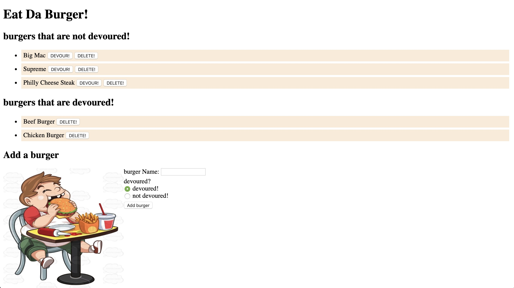

# sequelizedBurger

## Heroku Deployed Link

* https://sequelizedburger-bailing.herokuapp.com/

## Main View

* 

## App description

* This app is an upgraded version of burger-MySQL-Express-Handlebars. It still supports Create/Read/Update/Delete (CRUD), and uses a more concise Sequelize instead of MySQL connection.

* At the same time, it uses .associate to relate Burgers with Consumers.

## Languages/technologies/frameworks used

* Node.js
* Express
* Sequelize
* Handlebars
* JavaScript
* jQuery
* JSON
* Ajax
* MYSQL
* CSS
